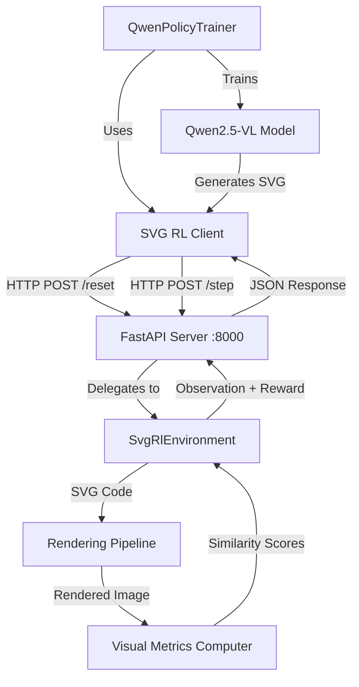
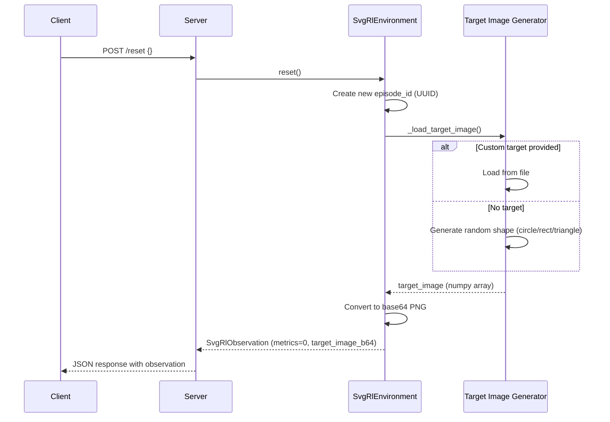
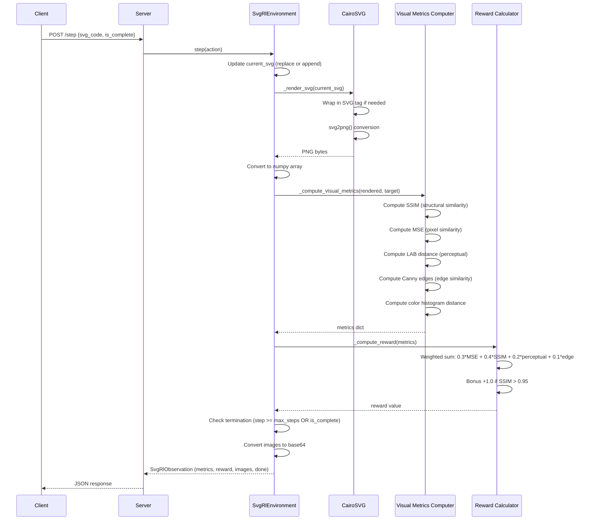
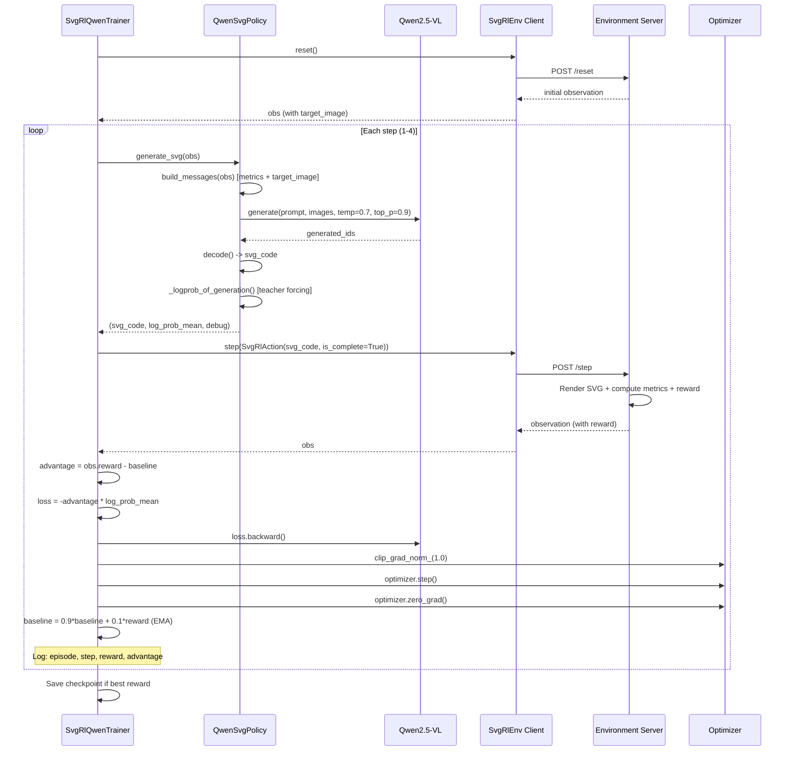
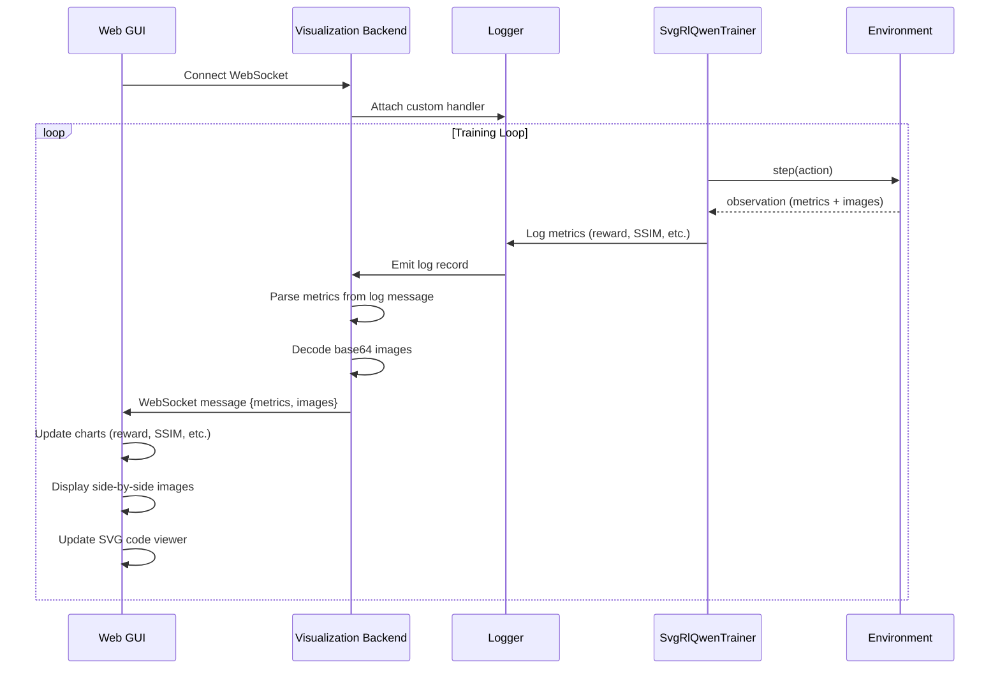

# SVG RL Environment - Comprehensive Onboarding Documentation

**Project**: OpenEnv SVG Reinforcement Learning Environment  
**Purpose**: Vision-conditioned RL environment for SVG generation using rendering-based feedback  
**Last Updated**: 2025-12-11

---

## 1. Overview

### What Problem Does This Solve?

The SVG RL Environment enables **vision-language models (VLMs) to learn SVG generation through reinforcement learning**. Instead of supervised learning on SVG datasets, agents receive visual feedback by comparing rendered SVG outputs against target images. This approach allows models like Qwen2.5-VL to optimize for visual quality directly.

### Key Features

- **Rendering-Aware Feedback**: Multi-metric visual similarity scoring (SSIM, MSE, perceptual distance, edge detection, color histograms)
- **OpenEnv Integration**: Standardized RL interface with HTTP API for distributed training
- **Client-Server Architecture**: Decoupled design enabling flexible deployment (Docker, local, cloud)
- **VLM-Optimized**: Custom prompting and policy gradient training for Qwen2.5-VL
- **Incremental Generation**: Supports both complete and step-wise SVG construction
- **Base64 Image Transmission**: Real-time visual feedback for monitoring/debugging

### Technologies Used

| Category | Technologies |
|----------|-------------|
| **Framework** | OpenEnv Core (v0.1.0+), FastAPI, Uvicorn |
| **RL Algorithm** | REINFORCE with EMA baseline |
| **Model** | Qwen2.5-VL-7B-Instruct (multimodal VLM) |
| **Rendering** | CairoSVG (SVG→PNG), Pillow, OpenCV |
| **Metrics** | scikit-image (SSIM), OpenCV (edge detection, histograms) |
| **Language** | Python 3.10+ |
| **ML Framework** | PyTorch 2.1+, Transformers 4.40+ |
| **Containerization** | Docker (multi-stage build) |

---

## 2. High-Level Architecture Diagram



### Component Explanations

- **SVG RL Client**: HTTP client that communicates with the environment server, used by RL agents to reset episodes and execute actions (SVG generation)
- **FastAPI Server**: Exposes REST API endpoints (`/reset`, `/step`, `/state`, `/health`) for environment interaction
- **SvgRlEnvironment**: Core RL environment implementing OpenEnv interface, manages episode state, target images, and reward computation
- **Rendering Pipeline**: CairoSVG-based SVG→PNG converter with image preprocessing
- **Visual Metrics Computer**: Computes 5 visual similarity metrics between rendered and target images
- **QwenPolicyTrainer**: REINFORCE-based policy gradient trainer with EMA baseline for variance reduction
- **Qwen2.5-VL Model**: 7B-parameter vision-language model that generates SVG code conditioned on target images and metrics

---

## 3. Component Breakdown

### Component: SVG RL Client

**File**: [`client.py`](/Users/younghan/project/OpenEnv/svg_rl_env/client.py)

**Purpose**: HTTP client for communicating with the SVG RL environment server. Extends `HTTPEnvClient` base class from OpenEnv Core.

**Key Elements**:
- [`SvgRlEnv`](/Users/younghan/project/OpenEnv/svg_rl_env/client.py#L50) - Main client class implementing action serialization and response parsing
- [`_step_payload()`](/Users/younghan/project/OpenEnv/svg_rl_env/client.py#L50) - Converts `SvgRlAction` to JSON payload
- [`_parse_result()`](/Users/younghan/project/OpenEnv/svg_rl_env/client.py#L65) - Deserializes JSON response to `SvgRlObservation`
- [`from_docker_image()`](/Users/younghan/project/OpenEnv/svg_rl_env/client.py#L19) - Factory method for Docker-based deployment

**Depends On**:
- **Internal**: `models.SvgRlAction`, `models.SvgRlObservation`
- **External**: `openenv-core` (HTTPEnvClient), `requests` (HTTP client)

**Usage Example**:
```python
from svg_rl_env.client import SvgRlEnv
from svg_rl_env.models import SvgRlAction

# Connect to server
client = SvgRlEnv(base_url="http://localhost:8000")

# Start episode
result = client.reset()
print(f"Target SSIM: {result.observation.structural_similarity}")

# Generate SVG
action = SvgRlAction(svg_code='<circle cx="128" cy="128" r="50"/>', is_complete=True)
result = client.step(action)
print(f"Reward: {result.reward}")
```

---

### Component: FastAPI Server

**File**: [`server/app.py`](/Users/younghan/project/OpenEnv/svg_rl_env/server/app.py)

**Purpose**: HTTP server exposing the RL environment via REST API. Uses OpenEnv's `create_app` factory to register routes.

**Key Elements**:
- [`create_app()`](/Users/younghan/project/OpenEnv/svg_rl_env/server/app.py#L39) - Factory function creating FastAPI app with environment
- **Endpoints**:
  - `POST /reset` - Initialize new episode with target image
  - `POST /step` - Execute action and get visual feedback
  - `GET /state` - Query current episode state
  - `GET /health` - Health check for orchestration

**Depends On**:
- **Internal**: `svg_rl_env_environment.SvgRlEnvironment`, `models.SvgRlAction`, `models.SvgRlObservation`
- **External**: `openenv-core` (create_app), `fastapi`, `uvicorn`

**Deployment**:
```bash
# Local development
uvicorn svg_rl_env.server.app:app --host 0.0.0.0 --port 8000 --reload

# Production with Docker
docker build -t svg-rl-env:latest -f server/Dockerfile .
docker run -p 8000:8000 svg-rl-env:latest
```

---

### Component: SvgRlEnvironment (Core RL Environment)

**File**: [`server/svg_rl_env_environment.py`](/Users/younghan/project/OpenEnv/svg_rl_env/server/svg_rl_env_environment.py)

**Purpose**: Implements OpenEnv's `Environment` interface, managing episode lifecycle, SVG rendering, and reward computation.

**Key Elements**:
- [`SvgRlEnvironment`](/Users/younghan/project/OpenEnv/svg_rl_env/server/svg_rl_env_environment.py#L26) - Main environment class
- [`reset()`](/Users/younghan/project/OpenEnv/svg_rl_env/server/svg_rl_env_environment.py#L98) - Initialize episode with target image
- [`step(action)`](/Users/younghan/project/OpenEnv/svg_rl_env/server/svg_rl_env_environment.py#L126) - Render SVG, compute metrics, return observation
- [`_render_svg()`](/Users/younghan/project/OpenEnv/svg_rl_env/server/svg_rl_env_environment.py#L240) - CairoSVG-based rendering
- [`_compute_visual_metrics()`](/Users/younghan/project/OpenEnv/svg_rl_env/server/svg_rl_env_environment.py#L265) - Multi-metric similarity computation
- [`_compute_reward()`](/Users/younghan/project/OpenEnv/svg_rl_env/server/svg_rl_env_environment.py#L317) - Weighted reward calculation

**Configuration Parameters**:
- `image_size: Tuple[int, int] = (256, 256)` - Canvas dimensions
- `target_image_path: Optional[str] = None` - Custom target or random generation
- `max_steps: int = 50` - Episode length limit
- `reward_weights: Dict` - Metric weighting for reward function

**Depends On**:
- **Internal**: `models.SvgRlAction`, `models.SvgRlObservation`
- **External**: `cairosvg` (rendering), `opencv-python` (metrics), `scikit-image` (SSIM), `pillow` (image I/O)

---

### Component: Data Models

**File**: [`models.py`](/Users/younghan/project/OpenEnv/svg_rl_env/models.py)

**Purpose**: Defines action and observation data structures using Python dataclasses for type safety and serialization.

**Key Elements**:

#### [`SvgRlAction`](/Users/younghan/project/OpenEnv/svg_rl_env/models.py#L22)
```python
@dataclass(kw_only=True)
class SvgRlAction(Action):
    svg_code: str           # SVG markup to render
    is_complete: bool       # Whether this completes the episode
```
- **Purpose**: Agent's action specification
- **Modes**:
  - Complete generation: `is_complete=True` replaces entire SVG
  - Incremental: `is_complete=False` appends to existing SVG

#### [`SvgRlObservation`](/Users/younghan/project/OpenEnv/svg_rl_env/models.py#L36)
```python
@dataclass(kw_only=True)
class SvgRlObservation(Observation):
    # Visual metrics (0-1 range)
    pixel_similarity: float              # MSE-based pixel match
    structural_similarity: float         # SSIM score
    perceptual_distance: float           # LAB color space distance
    edge_similarity: float               # Canny edge similarity
    color_histogram_distance: float      # Color distribution match
    
    # SVG metadata
    svg_complexity: int                  # Element count
    svg_valid: bool                      # Rendering success
    
    # Images (base64 PNG)
    rendered_image: Optional[str]        # Current SVG render
    target_image: Optional[str]          # Reference target
    
    # Episode state
    step_number: int
    done: bool
    reward: float
    metadata: Dict
```

**Depends On**:
- **External**: `openenv-core` (Action, Observation base classes)

---

### Component: Qwen Policy Trainer

**File**: [`qwen_svg_rl.py`](/Users/younghan/project/OpenEnv/svg_rl_env/qwen_svg_rl.py)

**Purpose**: REINFORCE-based policy gradient training for Qwen2.5-VL model using rendering feedback.

**Key Elements**:

#### [`QwenSvgPolicy`](/Users/younghan/project/OpenEnv/svg_rl_env/qwen_svg_rl.py#L75) - VLM Policy
- [`generate_svg()`](/Users/younghan/project/OpenEnv/svg_rl_env/qwen_svg_rl.py#L143) - Generate SVG from observation (with differentiable log probs)
- [`build_messages()`](/Users/younghan/project/OpenEnv/svg_rl_env/qwen_svg_rl.py#L115) - Construct multimodal prompt (metrics + target image)
- [`_logprob_of_generation()`](/Users/younghan/project/OpenEnv/svg_rl_env/qwen_svg_rl.py#L195) - Compute differentiable log probability for gradient computation

#### [`SvgRlQwenTrainer`](/Users/younghan/project/OpenEnv/svg_rl_env/qwen_svg_rl.py#L247) - Training Loop
- [`train()`](/Users/younghan/project/OpenEnv/svg_rl_env/qwen_svg_rl.py#L267) - Main REINFORCE training loop
- **Algorithm**: Policy gradient with EMA baseline for variance reduction
- **Hyperparameters**:
  - Learning rate: `2e-6` (AdamW)
  - Temperature: `0.7` (sampling)
  - Gradient clipping: `1.0`
  - Baseline momentum: `0.9` (EMA)

**Training Flow**:
```
For each episode:
  1. obs = env.reset()
  2. For each step (max 4):
     a. svg_code, log_prob = policy.generate_svg(obs)
     b. obs = env.step(SvgRlAction(svg_code, is_complete=True))
     c. advantage = obs.reward - baseline
     d. loss = -advantage * log_prob
     e. loss.backward() + optimizer.step()
     f. baseline = 0.9 * baseline + 0.1 * obs.reward
```

**Depends On**:
- **Internal**: `client.SvgRlEnv`, `models.SvgRlAction`, `models.SvgRlObservation`
- **External**: `transformers` (Qwen model), `torch` (optimization), `Pillow` (image decoding)

---

## 4. Data Flow & Call Flow Examples

### Example Flow 1: Episode Initialization (Reset)

**Description**: Client requests new episode, server generates target image, returns initial observation with zero metrics.

**Sequence Diagram**:


**Key Files**: 
- Client: [`client.py`](/Users/younghan/project/OpenEnv/svg_rl_env/client.py#L142)
- Server: [`server/app.py`](/Users/younghan/project/OpenEnv/svg_rl_env/server/app.py)
- Environment: [`server/svg_rl_env_environment.py`](/Users/younghan/project/OpenEnv/svg_rl_env/server/svg_rl_env_environment.py#L98)

---

### Example Flow 2: SVG Generation Step (Agent Action)

**Description**: Agent generates SVG code, server renders it, computes visual metrics, calculates reward, returns observation.

**Sequence Diagram**:


**Key Files**: 
- Step endpoint: [`server/app.py`](/Users/younghan/project/OpenEnv/svg_rl_env/server/app.py)
- Environment step: [`server/svg_rl_env_environment.py`](/Users/younghan/project/OpenEnv/svg_rl_env/server/svg_rl_env_environment.py#L126)
- Rendering: [`server/svg_rl_env_environment.py`](/Users/younghan/project/OpenEnv/svg_rl_env/server/svg_rl_env_environment.py#L240)
- Metrics: [`server/svg_rl_env_environment.py`](/Users/younghan/project/OpenEnv/svg_rl_env/server/svg_rl_env_environment.py#L265)
- Reward: [`server/svg_rl_env_environment.py`](/Users/younghan/project/OpenEnv/svg_rl_env/server/svg_rl_env_environment.py#L317)

---

### Example Flow 3: REINFORCE Training Loop

**Description**: Complete training iteration showing policy gradient update with EMA baseline.

**Sequence Diagram**:


**Key Files**: 
- Training loop: [`qwen_svg_rl.py`](/Users/younghan/project/OpenEnv/svg_rl_env/qwen_svg_rl.py#L267)
- Policy generation: [`qwen_svg_rl.py`](/Users/younghan/project/OpenEnv/svg_rl_env/qwen_svg_rl.py#L143)
- Log probability: [`qwen_svg_rl.py`](/Users/younghan/project/OpenEnv/svg_rl_env/qwen_svg_rl.py#L195)

---

### Example Flow 4: GUI Visualization Flow (Planned)

**Description**: Real-time monitoring of SVG generation progress during RL training.

**Sequence Diagram**:


**Key Integration Points for GUI**:
- **Metrics Stream**: Intercept `logger.info()` calls in [`qwen_svg_rl.py`](/Users/younghan/project/OpenEnv/svg_rl_env/qwen_svg_rl.py#L304)
- **Image Data**: Decode `observation.rendered_image` and `observation.target_image` (base64 PNG)
- **SVG Code**: Access `action.svg_code` for syntax-highlighted display
- **Episode State**: Monitor `observation.step_number`, `observation.done`, `total_reward`

---

## 5. Data Models (Entities)

### Entity: [SvgRlAction](/Users/younghan/project/OpenEnv/svg_rl_env/models.py#L22)

**Purpose**: Represents agent's action (SVG generation command)

**Fields**:
- `svg_code: str` - SVG markup to render
- `is_complete: bool = False` - Episode termination flag

**Usage Modes**:
- **Complete Generation**: `is_complete=True` replaces entire SVG and terminates episode
- **Incremental Generation**: `is_complete=False` appends to existing SVG (multi-step)

**Validation**:
- Type enforcement via dataclass
- SVG validity checked during rendering in environment

**Example**:
```python
# Complete generation (single step)
action = SvgRlAction(
    svg_code='<svg><circle cx="128" cy="128" r="50" fill="red"/></svg>',
    is_complete=True
)

# Incremental generation (multi-step)
action1 = SvgRlAction(svg_code='<rect x="0" y="0" width="100" height="100"/>', is_complete=False)
action2 = SvgRlAction(svg_code='<circle cx="128" cy="128" r="50"/>', is_complete=True)
```

---

### Entity: [SvgRlObservation](/Users/younghan/project/OpenEnv/svg_rl_env/models.py#L36)

**Purpose**: Environment's feedback on SVG rendering quality

**Fields** (grouped by category):

#### Visual Similarity Metrics (0-1 normalized)
- `pixel_similarity: float` - MSE-based pixel-wise match (1.0 = identical)
- `structural_similarity: float` - SSIM score measuring structure preservation
- `perceptual_distance: float` - LAB color space distance (perceptual quality)
- `edge_similarity: float` - Canny edge detection similarity
- `color_histogram_distance: float` - Color distribution match

#### SVG Metadata
- `svg_complexity: int` - Count of SVG elements (heuristic: opening tags - closing tags)
- `svg_valid: bool` - Whether SVG rendering succeeded

#### Rendered Outputs (base64-encoded PNG)
- `rendered_image: Optional[str]` - Current SVG rendered as PNG
- `target_image: Optional[str]` - Reference target image

#### Episode Tracking
- `step_number: int = 0` - Current step counter
- `done: bool = False` - Episode termination flag
- `reward: float = 0.0` - Computed reward value
- `metadata: Dict = {}` - Arbitrary additional data

**Computation Details**:
- **pixel_similarity**: `1.0 - min(MSE / 255², 1.0)` where MSE is mean squared error
- **structural_similarity**: `(SSIM + 1) / 2` converting SSIM's [-1, 1] to [0, 1]
- **perceptual_distance**: Mean LAB ΔE normalized by 255
- **edge_similarity**: `1.0 - mean(|Canny(rendered) - Canny(target)|) / 255`
- **color_histogram_distance**: Chi-square histogram comparison normalized to [0, 1]

**Reward Formula**:
```
base_reward = 0.3 × pixel_similarity 
            + 0.4 × structural_similarity 
            + 0.2 × (1.0 - perceptual_distance)
            + 0.1 × edge_similarity

final_reward = base_reward + 1.0  (if SSIM > 0.95)
```

---

### Entity: [State](/Users/younghan/project/OpenEnv/svg_rl_env/server/svg_rl_env_environment.py#L79)

**Purpose**: OpenEnv's internal episode state tracking

**Fields**:
- `episode_id: str` - UUID for current episode
- `step_count: int` - Number of steps taken

**Usage**: Accessed via `env.state` property for monitoring and logging

---

### Entity: [QwenPolicyConfig](/Users/younghan/project/OpenEnv/svg_rl_env/qwen_svg_rl.py#L58)

**Purpose**: Configuration for Qwen2.5-VL policy

**Fields**:
- `model_name: str = "Qwen/Qwen2.5-VL-7B-Instruct"` - Hugging Face model ID
- `device: Optional[str] = None` - Target device (None = auto-detect)
- `dtype: str = "auto"` - Precision (auto, float16, bfloat16, float32)
- `max_new_tokens: int = 196` - Max SVG code length
- `temperature: float = 0.7` - Sampling temperature
- `top_p: float = 0.9` - Nucleus sampling threshold

**Model Loading**:
```python
model = AutoModelForCausalLM.from_pretrained(
    config.model_name,
    device_map=config.device,
    torch_dtype=torch.float16 if config.dtype == "float16" else torch.bfloat16
)
```

---

## 6. Configuration & Deployment

### OpenEnv Configuration

**File**: [`openenv.yaml`](/Users/younghan/project/OpenEnv/svg_rl_env/openenv.yaml)

```yaml
spec_version: 1
name: svg_rl_env
type: space
runtime: fastapi
app: server.app:app
port: 8000
```

### Environment Configuration

**File**: [`server/svg_rl_env_environment.py`](/Users/younghan/project/OpenEnv/svg_rl_env/server/svg_rl_env_environment.py#L68)

```python
env = SvgRlEnvironment(
    image_size=(256, 256),              # Canvas dimensions
    target_image_path=None,              # Custom target or random generation
    max_steps=50,                        # Episode length limit
    reward_weights={                    # Metric weighting
        "pixel_similarity": 0.3,         # 30%
        "structural_similarity": 0.4,    # 40% (most important)
        "perceptual_distance": 0.2,      # 20%
        "edge_similarity": 0.1,          # 10%
    }
)
```

### Training Configuration

**File**: [`qwen_svg_rl.py`](/Users/younghan/project/OpenEnv/svg_rl_env/qwen_svg_rl.py#L249)

```python
trainer = SvgRlQwenTrainer(
    policy=policy,
    env_client=client,
    learning_rate=2e-6,                  # AdamW learning rate
    episodes=5,                          # Number of training episodes
    max_env_steps=4,                     # Steps per episode
    baseline_momentum=0.9,               # EMA smoothing
    save_every=1,                        # Checkpoint frequency
    grad_clip=1.0                        # Gradient clipping threshold
)
```

### Deployment Options

#### 1. Local Development
```bash
# Install dependencies
pip install -e ".[dev,qwen]"

# Run server
uvicorn svg_rl_env.server.app:app --host 0.0.0.0 --port 8000 --reload

# Run training (separate terminal)
python -m svg_rl_env.qwen_svg_rl
```

#### 2. Docker Deployment
```bash
# Build image
docker build -t svg-rl-env:latest -f server/Dockerfile .

# Run container
docker run -p 8000:8000 svg-rl-env:latest

# Client connects via Docker
from svg_rl_env import SvgRlEnv
client = SvgRlEnv.from_docker_image("svg-rl-env:latest")
```

---

## 7. GUI Integration Guide (For Future Development)

### Real-Time Monitoring Points

Based on the codebase analysis, here are the key integration points for building a visualization GUI:

#### Data Sources

1. **Training Metrics** (from [`qwen_svg_rl.py`](/Users/younghan/project/OpenEnv/svg_rl_env/qwen_svg_rl.py#L304))
   ```python
   logger.info("Episode %d Step %d | Reward %.4f | Advantage %.4f | SVG length %d")
   ```
   - Episode number, step number, reward, advantage, SVG length
   - Can intercept via custom `logging.Handler`

2. **Visual Feedback** (from [`models.py`](/Users/younghan/project/OpenEnv/svg_rl_env/models.py#L36))
   ```python
   observation.pixel_similarity         # 0-1
   observation.structural_similarity    # 0-1 (SSIM)
   observation.perceptual_distance      # 0-1
   observation.edge_similarity          # 0-1
   observation.color_histogram_distance # 0-1
   ```

3. **Images** (base64-encoded PNG)
   ```python
   observation.target_image      # Base64 string
   observation.rendered_image    # Base64 string
   ```

4. **SVG Code**
   ```python
   action.svg_code              # Raw SVG markup
   observation.svg_complexity   # Element count
   observation.svg_valid        # Rendering success flag
   ```

#### Suggested GUI Components

```
┌──────────────────────────────────────────────────────────┐
│                   SVG RL Training Monitor                │
├──────────────────────────────────────────────────────────┤
│                                                          │
│  ┌─────────────────┐  ┌─────────────────┐               │
│  │  Target Image   │  │ Rendered Image  │               │
│  │   (256×256)     │  │   (256×256)     │               │
│  └─────────────────┘  └─────────────────┘               │
│                                                          │
│  ┌────────────────────────────────────────────────────┐  │
│  │  Metrics Over Time                                │  │
│  │  📈 Reward: [────────────▲─]                     │  │
│  │  📊 SSIM:   [──────────▲───]                     │  │
│  │  📉 MSE:    [────▼─────────]                     │  │
│  │  🎨 Perceptual: [─────▲────]                     │  │
│  │  🔲 Edge: [──────▲──────]                        │  │
│  └────────────────────────────────────────────────────┘  │
│                                                          │
│  ┌────────────────────────────────────────────────────┐  │
│  │  SVG Code (Live)                                   │  │
│  │  <svg>                                             │  │
│  │    <circle cx="128" cy="128" r="50" fill="red"/>  │  │
│  │  </svg>                                            │  │
│  │                                                     │  │
│  │  Complexity: 1 element | Valid: ✓                 │  │
│  └────────────────────────────────────────────────────┘  │
│                                                          │
│  Episode: 3/5 | Step: 2/4 | Best Reward: 2.45          │
│                                                          │
└──────────────────────────────────────────────────────────┘
```

#### WebSocket Integration Example

```python
# Add to qwen_svg_rl.py training loop
import asyncio
import websockets
import json
import logging

class WebSocketHandler(logging.Handler):
    def __init__(self, websocket):
        super().__init__()
        self.websocket = websocket
    
    def emit(self, record):
        # Parse log message and send to GUI
        if "Episode" in record.getMessage():
            data = self.parse_training_log(record)
            asyncio.create_task(self.websocket.send(json.dumps(data)))

# In training loop, emit observation data
async def emit_observation(obs: SvgRlObservation):
    data = {
        "metrics": {
            "pixel_similarity": obs.pixel_similarity,
            "structural_similarity": obs.structural_similarity,
            "perceptual_distance": obs.perceptual_distance,
            "edge_similarity": obs.edge_similarity,
        },
        "images": {
            "target": obs.target_image,  # Base64 PNG
            "rendered": obs.rendered_image,
        },
        "svg": {
            "code": action.svg_code,
            "complexity": obs.svg_complexity,
            "valid": obs.svg_valid,
        },
        "episode_state": {
            "step": obs.step_number,
            "reward": obs.reward,
            "done": obs.done,
        }
    }
    await websocket.send(json.dumps(data))
```

---

## 8. Key Insights & Best Practices

### Design Patterns

1. **Rendering-Aware RL**: Uses visual feedback instead of supervised learning on SVG datasets
2. **Multi-Metric Reward**: Combines 5 visual metrics for robust training signal
3. **Client-Server Decoupling**: Environment runs independently, enabling distributed training
4. **Incremental Generation**: Supports both complete and step-wise SVG construction
5. **Variance Reduction**: EMA baseline stabilizes policy gradient updates

### Training Tips

1. **Low Learning Rate**: Use `lr=2e-6` for fine-tuning large VLMs
2. **Gradient Clipping**: Set `grad_clip=1.0` to prevent exploding gradients
3. **Temperature**: `temp=0.7` provides good exploration-exploitation tradeoff
4. **Baseline Warmup**: Initial episodes have high variance until baseline stabilizes
5. **Checkpoint Management**: Save best reward checkpoints for curriculum learning

### Performance Considerations

1. **Rendering Overhead**: CairoSVG rendering takes ~50-100ms per SVG
2. **Metric Computation**: SSIM and edge detection are computationally expensive
3. **Base64 Encoding**: Image transmission adds ~30% overhead
4. **Model Inference**: Qwen2.5-VL-7B requires GPU for reasonable speed
5. **Thread Pool**: FastAPI uses ThreadPoolExecutor to avoid blocking async loop

### Common Issues

1. **Invalid SVG**: Environment returns -1.0 reward and continues (doesn't crash)
2. **Cairo Dependencies**: Requires system-level `libcairo2-dev` installation
3. **GPU Memory**: Qwen2.5-VL-7B requires ~14GB VRAM in float16
4. **Timeout Errors**: Increase `timeout_s` for complex rendering operations

---

## 9. Quick Start Guide

### Installation
```bash
# Clone repository
git clone <repo-url>
cd svg_rl_env

# Install dependencies
pip install -e ".[qwen]"

# Install system dependencies (Ubuntu/Debian)
sudo apt-get install libcairo2-dev pkg-config python3-dev

# Or on macOS
brew install cairo pkg-config
```

### Running Your First Episode
```python
from svg_rl_env.client import SvgRlEnv
from svg_rl_env.models import SvgRlAction

# Start server (in separate terminal)
# uvicorn svg_rl_env.server.app:app --host 0.0.0.0 --port 8000

# Connect client
client = SvgRlEnv(base_url="http://localhost:8000")

# Reset environment
result = client.reset()
print(f"Target image loaded. Initial SSIM: {result.observation.structural_similarity}")

# Generate simple SVG
svg = '<circle cx="128" cy="128" r="50" fill="red"/>'
result = client.step(SvgRlAction(svg_code=svg, is_complete=True))

print(f"Reward: {result.reward:.4f}")
print(f"SSIM: {result.observation.structural_similarity:.4f}")
print(f"Valid: {result.observation.svg_valid}")
```

### Training Qwen Model
```bash
# Run REINFORCE training
python -m svg_rl_env.qwen_svg_rl

# Checkpoints saved to: ./qwen_svg_rl_checkpoints/
```

---

## 10. File Structure Reference

```
svg_rl_env/
├── README.md                              # Project overview
├── openenv.yaml                           # OpenEnv configuration
├── pyproject.toml                         # Python package metadata
├── models.py                              # Action & Observation dataclasses
├── client.py                              # HTTP client for environment
├── qwen_svg_rl.py                         # REINFORCE training script
├── server/
│   ├── app.py                             # FastAPI server entry point
│   ├── svg_rl_env_environment.py          # Core RL environment logic
│   └── Dockerfile                         # Container image definition
└── svg-rl-env-devmate-summary.md          # This documentation
```

---

## 11. Additional Resources

- **OpenEnv Documentation**: [Internal Meta documentation on OpenEnv framework]
- **Qwen2.5-VL**: [Hugging Face model card](https://huggingface.co/Qwen/Qwen2.5-VL-7B-Instruct)
- **CairoSVG**: [https://cairosvg.org/](https://cairosvg.org/)
- **SSIM Paper**: Wang et al. "Image Quality Assessment: From Error Visibility to Structural Similarity"
- **REINFORCE Algorithm**: Williams (1992) "Simple Statistical Gradient-Following Algorithms for Connectionist Reinforcement Learning"

---

**Generated by**: Devmate AI  
**Date**: 2025-12-11  
**Version**: 1.0
